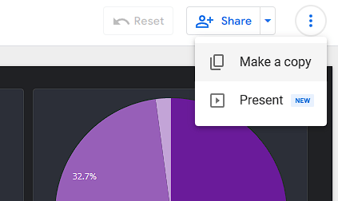
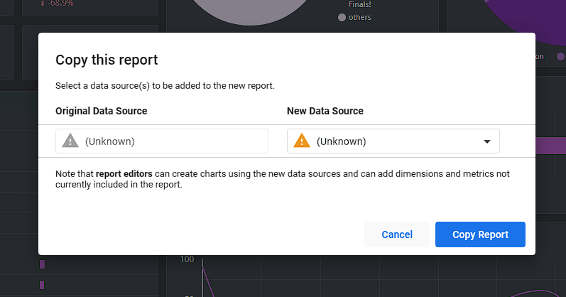
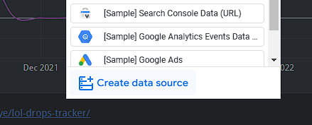
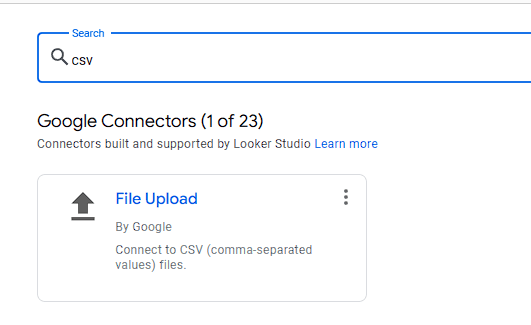
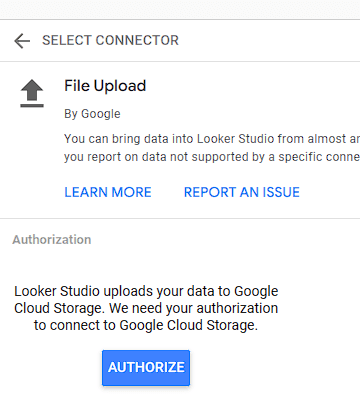
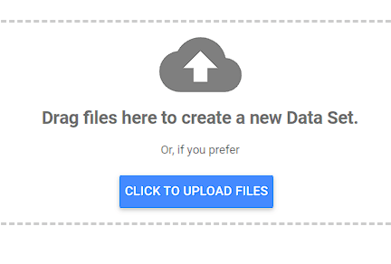
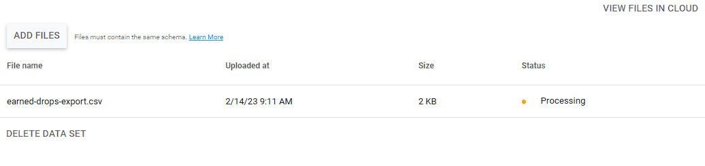
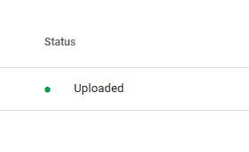
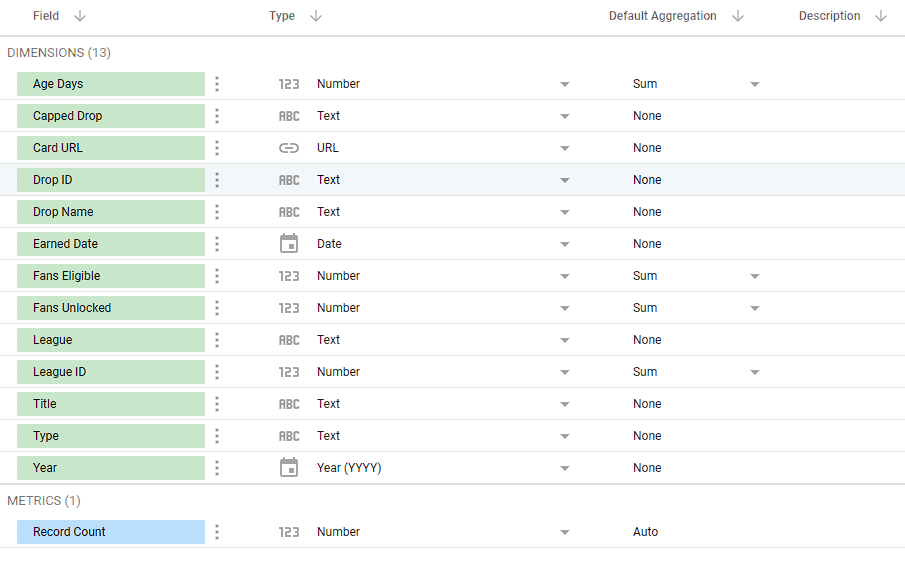
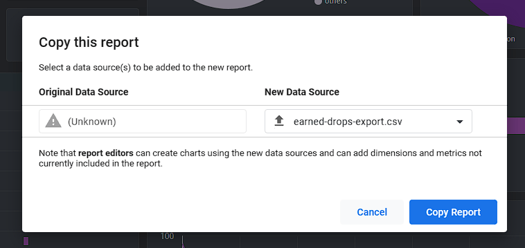

> :warning: **If you are looking to replace a report you created earlier with an updated template**: [see this section](#use-updated-template)

> :warning: **If you are looking to update your data**: [see this section](#update-dataset)

## How to visualize your drops data with Looker

Follow the below steps to set up your own Looker report based on a template I have put together. The reason I chose Looker is because it has the lowest barrier to entry technically and financially.

### Prerequisites:
* Have a Google account. Looker is part of Google Cloud Platoform.

### Steps:
1. Make sure you are signed into Google with the Google account you want to use and go to the [LoL Drops Looker report](https://lookerstudio.google.com/reporting/ecbc3929-393f-449d-a958-7ce3cde4cd06)

2. At the top right of the page, click the blue arrow next to the Share button and click `Make a Copy`

3. A Copy this report window will appear. Notice that new data source dropdown box shows an unknown source. The next few steps will walk through how to create your own data source with the CSV exported using the bookmarklet.

4. Click the New Data Source dropdown box and choose `Create data source` at the bottom.

5. On the next screen where you have to choose from a bunch of out-of-the-box connector, type `csv` into the search box and the `File Upload` connector should appear at the top of the list. Select the File Upload connector.

6. Before you can upload your CSV file, you need to authorize Looker to upload your data to Google Cloud Storage. Click `Authorize`. Note that the storage cost should be free and covered under the [free usage tier](https://cloud.google.com/free).

7. Click the blue button to upload your CSV files (e.g. `earned-drops-export-xxxxxxxxx.csv`).

8. After you upload the file, it should show up as `Processing`. Wait until the staus turns green `Uploaded` before moving on to the next step by clicking the blue `Connect` button at the top right.

9. The next screen allows you to inspect what fields exist in the drops data you just uploaded. Click the blue `Add to Report` button when you are ready to move on.

10. Now you should be back to the first screen with Copy this report window. Choose the new data source you just created in the New Data Source dropdown box and click `Copy Report`.

At this point, you should see a copy of LoL Drops report populated with your down data that you exported earlier. You can freely customize it to your preference as well as adding additional pages and charts.

Also, note that once you make a copy of the report, it will not update itself when I update the source template. You will need to go through this process again to get any updates.

## Use Updated Template

From time to time I update my template, especially with requests from fellow discord users. If you had copied my template in the past to make your own report, all you need to do it make a copy of the template again (usually it has a new link), but instead of creating a new data source, you will use the same data source created earlier. The whole process should only take a minute.

## Update Dataset

Say you want to update your data daily or weekly, below are the steps to do just that:

1. Use the bookmarklet to export your data
2. Go to your [data sources](https://lookerstudio.google.com/u/0/navigation/datasources) in Looker Studio
3. Click on your data source and click `Edit Connection` at the top left on the next screen
4. Delete the existing CSV from the dataset and upload your newly exported data
5. Click `Reconnect` at the top right
6. Go back to your report, click on the 3-dot button, and choose `Refresh data`